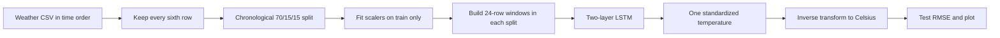

# LSTM project: weather forecasting, explained line by line

[Study index](README.md) · [Original notebook](LSTM_Weather_Forecasting.ipynb) · [LSTM foundations](LSTM/README.md)

## What the project predicts

The notebook uses six weather measurements over the previous 24 timesteps to predict **one temperature at the next timestep**. This is multivariate-input, single-output time-series regression. It is not a prediction of all six measurements and not a 24-step future forecast.

The code retains every sixth row of the downloaded Jena climate table. If the source is ordered at regular ten-minute intervals, this produces one retained observation per hour. Under that assumption, 24 timesteps represent 24 hours of context and the target is the next hour. The source does not parse timestamps or verify that cadence; verify those facts before attaching hour units to another CSV.

## Before running

Required imports come from kagglehub, pandas, NumPy, scikit-learn, PyTorch, and matplotlib. The code downloads a dataset and uses the first recursively found filename ending in `.csv`. If multiple CSVs exist, this is not an explicit selection of the intended period or schema. Inspect the printed filenames and choose the intended file deliberately when necessary.

The selected columns are pressure, temperature, relative humidity, wind speed, maximum wind speed, and wind direction. Their order matters because the network's six inputs and the scaler statistics are positional. This guide has not downloaded the dataset or measured a new RMSE.

## The data flow



## Six input features

| Column | Meaning | Interpretation |
|---|---|---|
| `p (mbar)` | Air pressure | Different numerical scale from temperature |
| `T (degC)` | Temperature | Historical temperature is also an input |
| `rh (%)` | Relative humidity | Percentage measurement |
| `wv (m/s)` | Wind speed | Inspect missing/sentinel values |
| `max. wv (m/s)` | Maximum wind speed | Same need for data-quality checks |
| `wd (deg)` | Wind direction | Circular: 359° and 1° are close physically |

Using past temperature as an input is valid. The target is the temperature immediately **after** the last input row, so the same target timestamp is not included in its input window.

## Window and shape arithmetic

For start index i, input is `X[i:i+24]`, which includes rows i through i+23. Target is `y[i+24]`. If a split contains M retained rows, it creates `M-24` examples when M>24. A toy six-row split with context three creates inputs `[0,1,2]`, `[1,2,3]`, `[2,3,4]` and targets 3, 4, 5.

| Object | Shape | Meaning |
|---|---|---|
| Raw feature table for a split | `[M,6]` | Ordered weather observations |
| Scaled target table | `[M,1]` | Standardized temperature |
| All input windows | `[M-24,24,6]` | One 24-step history per example |
| All targets | `[M-24,1]` | One next-step temperature per window |
| Training batch | `[B,24,6]` | Usually B=128 |
| LSTM sequence output | `[B,24,64]` | Last layer's hidden output at each step |
| Final hidden and cell states | Each `[2,B,64]` | Two layers, one direction |
| `hidden[-1]` | `[B,64]` | Final hidden state of the top layer |
| Linear output | `[B,1]` | One standardized predicted temperature |

`num_layers=2` means two recurrent layers stacked vertically, not two timesteps. Every window still has 24 timesteps. The LSTM's `dropout=0.2` acts between its layers during training; it is not an extra Dropout after the final regression head. The official [LSTM API](https://docs.pytorch.org/docs/stable/generated/torch.nn.LSTM.html) defines these layer/state conventions.

## Scaling, loss, and real units

For each feature the scaler uses `(value - training_mean) / training_std`. Target scaling uses temperature's training statistics in a separate one-column scaler. Neither scaler is fitted on validation or test data. The temperature feature and target scalers derive the same temperature statistics here because they use the same training rows, but separate objects make inversion clearer.

Mean squared error is `mean((prediction - target)**2)`. During training both values are standardized, so this loss is not in degrees Celsius squared. After applying `target_scaler.inverse_transform`, RMSE is `sqrt(mean((predicted_C - actual_C)**2))` in °C. Larger mistakes contribute more because they are squared.

Illustrative scaling: if the training temperature mean were 10°C and standard deviation 5°C, a standardized prediction of 0.4 would correspond to `0.4×5+10=12°C`. These numbers illustrate the formula, not the fitted values in the user's dataset.

The model has **51,777 trainable values**: the first LSTM layer has 18,432, the second 33,280, and Linear(64,1) has 65. Each LSTM layer contains four gates with input/recurrent weights and two bias vectors. State is initialized afresh for each forward call because the code does not pass hidden/cell states between batches.

## Notebook walkthrough

Cell numbers below count all notebook cells from one, including Markdown cells. Line numbers restart in each code block and count its blank lines. Every nonblank line has an explanation; blank lines only provide spacing. The original code is reproduced unchanged, so notebook limitations described later also apply to these blocks.

### Cell 1: Install the dataset download client

```python
!pip -q install kagglehub
```

| Line | Explanation |
|---|---|
| L1 | Runs a notebook shell command to install kagglehub; `-q` reduces installation output. This is notebook syntax, not ordinary Python-script syntax. |

### Cell 2: Download climate data

```python
import kagglehub

path = kagglehub.dataset_download(
    "samehraouf/jena-climate-time-series-2009-2017-dataset"
)

print(path)
```

| Line | Explanation |
|---|---|
| L1 | Imports the client used by the next cell to download the project dataset. |
| L3 | Downloads or locates a cached dataset and assigns its returned local directory to `path`. |
| L4 | Identifies the Jena climate dataset requested by the notebook. The returned path points to the downloaded/cached directory. |
| L5 | Closes the multiline call, collection, or grouped expression above; it adds no separate numerical operation. |
| L7 | Displays the returned dataset directory so later file paths can be checked. |

### Cell 3: Inspect the downloaded files

```python
import os

for root, dirs, files in os.walk(path):
    for f in files:
        print(os.path.join(root, f))
```

| Line | Explanation |
|---|---|
| L1 | Imports filesystem utilities used to inspect the downloaded directory. |
| L3 | Traverses the dataset directory recursively. Each iteration gives the current directory, its subdirectories, and its filenames. |
| L4 | Iterates filenames in the current directory from os.walk. |
| L5 | Prints each complete file path so the available CSV files can be inspected. |

### Cell 4: Locate and read a CSV

```python
import pandas as pd

csv_file = [
    os.path.join(root, file)
    for root, dirs, files in os.walk(path)
    for file in files
    if file.endswith(".csv")
][0]

df = pd.read_csv(csv_file)

print(df.shape)
df.head()
```

| Line | Explanation |
|---|---|
| L1 | Imports pandas as `pd` for reading and manipulating tabular data. |
| L3 | Begins collecting paths of CSV files into a list comprehension. |
| L4 | Constructs a complete path from the current directory and filename. |
| L5 | Recursively visits directories under the downloaded dataset path. |
| L6 | Visits every filename in each directory. |
| L7 | Keeps filenames ending exactly in `.csv`; the check is case-sensitive. |
| L8 | Selects the first collected CSV path. With no matches this raises an index error; with multiple matches it may choose an unintended file. |
| L10 | Loads the chosen CSV into a pandas DataFrame. Date columns are not parsed or sorted here. |
| L12 | Displays the DataFrame's row and column counts at this point in preprocessing. |
| L13 | Displays the first rows in a notebook so columns and sample values can be inspected. |

### Cell 5: Retain every sixth observation

```python
df = df.iloc[::6].reset_index(drop=True)
```

| Line | Explanation |
|---|---|
| L1 | Keeps row positions 0, 6, 12, and so on, then resets the index. This is subsampling, not an hourly average; hourly interpretation assumes a regular ten-minute source. |

### Cell 6: Check the reduced table size

```python
print(df.shape)
```

| Line | Explanation |
|---|---|
| L1 | Displays the DataFrame's row and column counts at this point in preprocessing. |

### Cell 7: Select the six weather features

```python
features = [
    "p (mbar)",
    "T (degC)",
    "rh (%)",
    "wv (m/s)",
    "max. wv (m/s)",
    "wd (deg)"
]

data = df[features].copy()

data.head()
```

| Line | Explanation |
|---|---|
| L1 | Begins an ordered list of the six model input columns. |
| L2 | Selects air pressure in millibars as feature zero. |
| L3 | Selects historical temperature in Celsius as feature one; future temperature will be the target. |
| L4 | Selects relative humidity as feature two. |
| L5 | Selects wind speed as feature three. |
| L6 | Selects maximum wind speed as feature four. |
| L7 | Selects wind direction in degrees as feature five. |
| L8 | Closes the multiline call, collection, or grouped expression above; it adds no separate numerical operation. |
| L10 | Copies those columns into an independent DataFrame in exactly the listed order. |
| L12 | Previews selected feature values to inspect units and obvious anomalies. |

### Cell 8: Make a chronological split

This assumes row order is chronological. Randomly splitting strongly overlapping time windows can make evaluation optimistic, so the source splits the raw timeline before constructing windows.

```python
import numpy as np

n = len(data)

train_end = int(n * 0.70)
val_end = int(n * 0.85)

train_data = data.iloc[:train_end]
val_data = data.iloc[train_end:val_end]
test_data = data.iloc[val_end:]
```

| Line | Explanation |
|---|---|
| L1 | Imports NumPy as `np` for numerical arrays and conversions. |
| L3 | Counts retained observations after subsampling and feature selection. |
| L5 | Calculates the integer row boundary for the first 70% of observations. |
| L6 | Calculates the boundary at 85%, leaving a final 15% segment. |
| L8 | Uses the earliest 70% of rows for training, preserving row order. |
| L9 | Uses the next approximately 15% for validation. |
| L10 | Uses the latest approximately 15% for testing. Integer rounding can make exact counts differ slightly from the percentages. |

### Cell 9: Fit feature and target scalers on training data

```python
from sklearn.preprocessing import StandardScaler

feature_scaler = StandardScaler()
target_scaler = StandardScaler()

feature_scaler.fit(train_data[features])

target_scaler.fit(
    train_data[["T (degC)"]]
)
```

| Line | Explanation |
|---|---|
| L1 | Imports the per-column standardization helper from scikit-learn. |
| L3 | Creates a scaler that will learn one mean and scale for each of six input columns. |
| L4 | Creates a separate scaler for the one-dimensional temperature target. |
| L6 | Fits feature statistics using only training rows and the fixed feature order. |
| L8 | Begins fitting the target scaler, also using only training rows. |
| L9 | Selects temperature with double brackets so the input stays a two-dimensional `[M,1]` table as required by the scaler. |
| L10 | Closes the multiline call, collection, or grouped expression above; it adds no separate numerical operation. |

### Cell 10: Apply the fitted scalers to all splits

```python
X_train_scaled = feature_scaler.transform(train_data[features])
X_val_scaled = feature_scaler.transform(val_data[features])
X_test_scaled = feature_scaler.transform(test_data[features])

y_train_scaled = target_scaler.transform(train_data[["T (degC)"]])
y_val_scaled = target_scaler.transform(val_data[["T (degC)"]])
y_test_scaled = target_scaler.transform(test_data[["T (degC)"]])
```

| Line | Explanation |
|---|---|
| L1 | Transforms training input features with the previously learned six-column statistics. |
| L2 | Transforms validation features using those same training statistics, without refitting. |
| L3 | Transforms test features with the same mapping, preserving comparability. |
| L5 | Standardizes training temperature targets into `[M_train,1]`. |
| L6 | Standardizes validation temperatures with the training target mapping. |
| L7 | Standardizes test temperatures with that same mapping for later loss/inversion. |

### Cell 12: Define next-step windows

Every split must have more than 24 rows. Otherwise the lists are empty, and this function does not construct the intended three-dimensional input shape.

```python
SEQ_LEN = 24

def create_sequences(X, y, seq_len=24):

    sequences = []
    targets = []

    for i in range(len(X) - seq_len):

        sequences.append(
            X[i:i + seq_len]
        )

        targets.append(
            y[i + seq_len]
        )

    return (
        np.array(sequences, dtype=np.float32),
        np.array(targets, dtype=np.float32)
    )
```

| Line | Explanation |
|---|---|
| L1 | Sets the context length to 24 retained timesteps. |
| L3 | Defines a function accepting scaled feature and target arrays plus a window length; its default is also 24. |
| L5 | Creates a list to collect feature windows. |
| L6 | Creates a parallel list to collect next-step targets. |
| L8 | Iterates valid window starts. The last input window must leave one following target row. |
| L10 | Begins appending one feature window to the sequence list. |
| L11 | Slices rows i through i+seq_len-1; the stop index is exclusive, so the target row is not included. |
| L12 | Closes the multiline call, collection, or grouped expression above; it adds no separate numerical operation. |
| L14 | Begins appending the matching future target. |
| L15 | Selects the temperature at the very next row after the input window. |
| L16 | Closes the multiline call, collection, or grouped expression above; it adds no separate numerical operation. |
| L18 | Begins returning a pair of NumPy arrays suitable for Dataset construction. |
| L19 | Stacks input windows and converts them to float32, normally `[M-seq_len,seq_len,6]`. |
| L20 | Stacks matching targets as float32, normally `[M-seq_len,1]`. |
| L21 | Closes the multiline call, collection, or grouped expression above; it adds no separate numerical operation. |

### Cell 13: Create train, validation, and test examples

Because windows are constructed separately per split, the first 24 rows of validation/test provide context but are not target timestamps. This keeps windows within their split; it also discards some boundary forecasts that could be constructed using earlier historical context.

```python
X_train, y_train = create_sequences(
    X_train_scaled,
    y_train_scaled,
    SEQ_LEN
)

X_val, y_val = create_sequences(
    X_val_scaled,
    y_val_scaled,
    SEQ_LEN
)

X_test, y_test = create_sequences(
    X_test_scaled,
    y_test_scaled,
    SEQ_LEN
)

print(X_train.shape)
print(y_train.shape)
```

| Line | Explanation |
|---|---|
| L1 | Begins generating windows only within the training segment. |
| L2 | Supplies standardized training features. |
| L3 | Supplies standardized training temperatures for targets. |
| L4 | Uses the configured 24-step context. |
| L5 | Closes the multiline call, collection, or grouped expression above; it adds no separate numerical operation. |
| L7 | Begins generating independent validation windows. |
| L8 | Supplies standardized validation features. |
| L9 | Supplies validation temperatures as targets. |
| L10 | Uses the same 24-step context length. |
| L11 | Closes the multiline call, collection, or grouped expression above; it adds no separate numerical operation. |
| L13 | Begins generating independent test windows. |
| L14 | Supplies standardized test features. |
| L15 | Supplies standardized test temperature targets. |
| L16 | Uses the same context length as training. |
| L17 | Closes the multiline call, collection, or grouped expression above; it adds no separate numerical operation. |
| L19 | Displays the training window array shape, expected `[number_of_windows,24,6]`. |
| L20 | Displays target shape, expected `[number_of_windows,1]`. |

### Cell 14: Wrap arrays in TensorDatasets

```python
import torch

from torch.utils.data import (
    TensorDataset,
    DataLoader
)

train_dataset = TensorDataset(
    torch.tensor(X_train),
    torch.tensor(y_train)
)

val_dataset = TensorDataset(
    torch.tensor(X_val),
    torch.tensor(y_val)
)

test_dataset = TensorDataset(
    torch.tensor(X_test),
    torch.tensor(y_test)
)
```

| Line | Explanation |
|---|---|
| L1 | Imports PyTorch; tensors, device selection, and gradient-control functions use this name. |
| L3 | Begins importing Dataset and loader helpers used below. |
| L4 | Imports TensorDataset, which pairs tensors by their shared first-axis index. |
| L5 | Imports DataLoader for batching those pairs. |
| L6 | Closes the multiline call, collection, or grouped expression above; it adds no separate numerical operation. |
| L8 | Begins constructing the training Dataset from aligned inputs and targets. |
| L9 | Copies the float32 training windows into a PyTorch tensor, preserving shape. |
| L10 | Copies corresponding float32 training targets into a tensor. |
| L11 | Closes the multiline call, collection, or grouped expression above; it adds no separate numerical operation. |
| L13 | Creates the validation Dataset using the same pairing convention. |
| L14 | Converts validation windows to a tensor. |
| L15 | Converts validation targets to a tensor. |
| L16 | Closes the multiline call, collection, or grouped expression above; it adds no separate numerical operation. |
| L18 | Creates the test Dataset. |
| L19 | Converts test windows to a tensor. |
| L20 | Converts test targets to a tensor. |
| L21 | Closes the multiline call, collection, or grouped expression above; it adds no separate numerical operation. |

### Cell 15: Batch windows while preserving their internal time order

Training shuffle changes which complete window comes first. It does not rearrange the 24 timesteps within a window. Since hidden state is reset per forward call, the model treats windows as independent examples. Test order is preserved for the final plot.

```python
train_loader = DataLoader(
    train_dataset,
    batch_size=128,
    shuffle=True,
    pin_memory=True
)

val_loader = DataLoader(
    val_dataset,
    batch_size=128,
    shuffle=False,
    pin_memory=True
)

test_loader = DataLoader(
    test_dataset,
    batch_size=128,
    shuffle=False,
    pin_memory=True
)
```

| Line | Explanation |
|---|---|
| L1 | Constructs the training loader over already-built windows. |
| L2 | Supplies the training window/target Dataset. |
| L3 | Combines up to 128 examples per batch; the last batch may contain fewer. |
| L4 | Randomizes the order of examples each time the training loader is traversed; the order within each example is preserved. |
| L5 | Requests pinned host memory where supported, which can help transfers to CUDA. This does not place the batch on the GPU. |
| L6 | Closes the multiline call, collection, or grouped expression above; it adds no separate numerical operation. |
| L8 | Constructs the validation loader; it is not actually used by the source training loop. |
| L9 | Supplies validation windows and targets. |
| L10 | Combines up to 128 examples per batch; the last batch may contain fewer. |
| L11 | Preserves Dataset order, useful for repeatable evaluation and aligned plots. |
| L12 | Requests pinned host memory where supported, which can help transfers to CUDA. This does not place the batch on the GPU. |
| L13 | Closes the multiline call, collection, or grouped expression above; it adds no separate numerical operation. |
| L15 | Constructs the test loader used for final predictions. |
| L16 | Supplies the latest chronological segment's windows and targets. |
| L17 | Combines up to 128 examples per batch; the last batch may contain fewer. |
| L18 | Preserves Dataset order, useful for repeatable evaluation and aligned plots. |
| L19 | Requests pinned host memory where supported, which can help transfers to CUDA. This does not place the batch on the GPU. |
| L20 | Closes the multiline call, collection, or grouped expression above; it adds no separate numerical operation. |

### Cell 17: Define the two-layer temperature LSTM

```python
import torch.nn as nn

class TemperatureLSTM(nn.Module):

    def __init__(
        self,
        input_size=6,
        hidden_size=64,
        num_layers=2
    ):
        super().__init__()

        self.lstm = nn.LSTM(
            input_size=input_size,
            hidden_size=hidden_size,
            num_layers=num_layers,
            batch_first=True,
            dropout=0.2
        )

        self.fc = nn.Linear(
            hidden_size,
            1
        )

    def forward(self, x):

        output, (hidden, cell) = self.lstm(x)

        final_hidden = hidden[-1]

        prediction = self.fc(final_hidden)

        return prediction
```

| Line | Explanation |
|---|---|
| L1 | Imports neural-network layers and losses under the short name `nn`. |
| L3 | Declares a regression model inheriting PyTorch module behavior. |
| L5 | Begins its constructor signature. |
| L6 | Refers to this model instance. |
| L7 | Defaults each timestep to six input features, matching the selected weather columns. |
| L8 | Defaults each recurrent layer's hidden/cell width to 64. |
| L9 | Stacks two recurrent layers, with the second consuming the first layer's hidden outputs. |
| L10 | Closes the multiline definition header and begins its indented body. |
| L11 | Initializes nn.Module bookkeeping before assigning child layers and their registered parameters. |
| L13 | Creates the LSTM module, which internally calculates input, forget, candidate, and output gate operations. |
| L14 | Sets the first layer's input feature count. |
| L15 | Sets the recurrent hidden/cell width in both layers. |
| L16 | Configures two stacked layers under the default constructor values. |
| L17 | Declares `[batch, time, features]` layout for this sequence operation. |
| L18 | Applies dropout with probability 0.2 between recurrent layers during training. It does not apply after the final layer's output head. |
| L19 | Closes the multiline call, collection, or grouped expression above; it adds no separate numerical operation. |
| L21 | Begins constructing a linear regression head. |
| L22 | Consumes the top layer's 64-value final hidden representation. |
| L23 | Produces one unrestricted scalar prediction per example; no sigmoid or class softmax is appropriate here. |
| L24 | Closes the multiline call, collection, or grouped expression above; it adds no separate numerical operation. |
| L26 | Defines the forward computation for a batch of weather windows. |
| L28 | Runs the entire window through the LSTM. Sequence output is `[B,24,64]`; final hidden and cell each have `[2,B,64]`. |
| L30 | Selects the top recurrent layer's final hidden state, producing `[B,64]`. |
| L32 | Maps each final representation to one standardized temperature prediction `[B,1]`. |
| L34 | Returns that prediction for MSE loss or later inverse transformation. |

### Cell 18: Instantiate the regression model

```python
device = torch.device(
    "cuda" if torch.cuda.is_available() else "cpu"
)

model = TemperatureLSTM().to(device)

print(model)
```

| Line | Explanation |
|---|---|
| L1 | Begins selecting the device on which model parameters and input tensors will be stored. |
| L2 | Chooses CUDA when PyTorch can use it; otherwise selects CPU. |
| L3 | Closes the multiline call, collection, or grouped expression above; it adds no separate numerical operation. |
| L5 | Constructs TemperatureLSTM with six inputs, hidden width 64, and two layers, then moves it to the selected device. |
| L7 | Prints the registered architecture, useful for checking layer widths and configuration. |

### Cell 20: Configure regression loss and Adam

```python
criterion = nn.MSELoss()

optimizer = torch.optim.Adam(
    model.parameters(),
    lr=0.001
)
```

| Line | Explanation |
|---|---|
| L1 | Creates mean squared error, averaging squared differences between `[B,1]` predictions and matching standardized targets. |
| L3 | Constructs Adam, an optimizer that maintains running gradient statistics for parameter updates. |
| L4 | Supplies the model's registered parameters, including learned embeddings or feature layers where present, to the optimizer. |
| L5 | Sets the initial learning rate to 0.001. |
| L6 | Closes the multiline call, collection, or grouped expression above; it adds no separate numerical operation. |

### Cell 22: Train on window/target pairs

The validation loader is never consulted in this loop. All ten epochs run, and the final weights are used for testing. There is no early stopping, best-validation checkpoint, scheduler, or gradient clipping in the source.

```python
EPOCHS = 10

for epoch in range(EPOCHS):

    model.train()

    total_loss = 0

    for X_batch, y_batch in train_loader:

        X_batch = X_batch.to(device)
        y_batch = y_batch.to(device)

        optimizer.zero_grad()

        predictions = model(X_batch)

        loss = criterion(
            predictions,
            y_batch
        )

        loss.backward()

        optimizer.step()

        total_loss += loss.item()

    avg_loss = total_loss / len(train_loader)

    print(
        f"Epoch {epoch+1}/{EPOCHS} "
        f"Loss: {avg_loss:.4f}"
    )
```

| Line | Explanation |
|---|---|
| L1 | Requests ten complete traversals of the training loader. |
| L3 | Repeats training with epoch indices starting at zero and ending at `EPOCHS - 1`. |
| L5 | Selects training behavior. Dropout and BatchNorm, if present, use their training rules; this call does not itself compute gradients. |
| L7 | Resets the accumulated sum of batch-mean losses for this epoch. |
| L9 | Iterates shuffled complete windows and their next-step targets. |
| L11 | Moves the floating weather windows `[B,24,6]` to the LSTM device. |
| L12 | Moves standardized temperature targets `[B,1]` to the model device. |
| L14 | Clears old parameter gradients so this batch does not accidentally accumulate gradients from the previous batch. |
| L16 | Predicts one standardized temperature for each window using current model parameters. |
| L18 | Begins evaluating the MSE loss for this batch. |
| L19 | Supplies model outputs `[B,1]`. |
| L20 | Supplies matching standardized target temperatures `[B,1]`. |
| L21 | Closes the multiline call, collection, or grouped expression above; it adds no separate numerical operation. |
| L23 | Backpropagates from the scalar loss and fills parameter gradients. It does not change parameter values yet. |
| L25 | Uses the newly computed gradients and Adam's state to update trainable parameter values. |
| L27 | Adds this batch's mean loss to the epoch sum, without retaining its computation graph. |
| L29 | Computes an equal average of the batch-mean MSE values; this is not a Celsius RMSE. |
| L31 | Begins printing a readable progress or metric message assembled by the following lines. |
| L32 | Formats the one-based epoch counter and requested epoch total. |
| L33 | Displays the standardized training MSE average to four decimal places. |
| L34 | Closes the multiline call, collection, or grouped expression above; it adds no separate numerical operation. |

### Cell 24: Predict temperatures for ordered test windows

This is rolling one-step prediction using observed history for every window. The model does not feed its own predicted temperature into the next test window and does not perform a recursive multi-hour forecast.

```python
model.eval()

predictions = []
actuals = []

with torch.no_grad():

    for X_batch, y_batch in test_loader:

        X_batch = X_batch.to(device)

        output = model(X_batch)

        predictions.extend(
            output.cpu().numpy()
        )

        actuals.extend(
            y_batch.numpy()
        )
```

| Line | Explanation |
|---|---|
| L1 | Selects evaluation behavior for mode-sensitive layers. Gradient tracking is controlled separately. |
| L3 | Creates a list for standardized model predictions in test-window order. |
| L4 | Creates a corresponding list for standardized true temperatures. |
| L6 | Disables graph recording for the indented inference block, reducing work and memory. |
| L8 | Visits test windows in chronological target order because this loader has shuffle=False. |
| L10 | Moves the floating weather windows `[B,24,6]` to the LSTM device. |
| L12 | Computes `[B,1]` standardized predictions from actual historical weather windows. |
| L14 | Begins appending this batch's predictions to the list. |
| L15 | Moves predictions to CPU and converts them to NumPy rows. No detach is needed inside no-grad. |
| L16 | Closes the multiline call, collection, or grouped expression above; it adds no separate numerical operation. |
| L18 | Begins appending corresponding actual target rows. |
| L19 | Converts labels directly to NumPy because this evaluation loop left `y_batch` on CPU. |
| L20 | Closes the multiline call, collection, or grouped expression above; it adds no separate numerical operation. |

### Cell 26: Convert predictions and targets back to Celsius

Use `target_scaler`, not the six-feature scaler. This cell overwrites the standardized lists with Celsius arrays. Rerunning it without rebuilding the lists would inverse-transform Celsius values a second time and produce incorrect numbers.

```python
predictions = target_scaler.inverse_transform(
    np.array(predictions)
)

actuals = target_scaler.inverse_transform(
    np.array(actuals)
)
```

| Line | Explanation |
|---|---|
| L1 | Begins undoing the target scaler's training mean/scale on the prediction list. |
| L2 | Converts the list of one-element prediction rows into a two-dimensional NumPy array. |
| L3 | Closes the multiline call, collection, or grouped expression above; it adds no separate numerical operation. |
| L5 | Applies the same inverse temperature transformation to actual target values. |
| L6 | Converts the actual-value list into a matching `[number_of_test_windows,1]` array. |
| L7 | Closes the multiline call, collection, or grouped expression above; it adds no separate numerical operation. |

### Cell 28: Calculate test RMSE in Celsius

```python
from sklearn.metrics import mean_squared_error

rmse = mean_squared_error(
    actuals,
    predictions
) ** 0.5

print("RMSE:", rmse, "°C")
```

| Line | Explanation |
|---|---|
| L1 | Imports sklearn's squared-error metric. |
| L3 | Begins calculating mean squared error over matching test predictions and targets in Celsius. |
| L4 | Supplies actual temperatures as the reference values. |
| L5 | Supplies model-predicted temperatures in the same order. |
| L6 | Raises the MSE to power 0.5, taking the square root to obtain Celsius units. |
| L8 | Prints the measured root mean squared error and its °C unit. |

### Cell 29: Plot the first 300 predictions

```python
import matplotlib.pyplot as plt

plt.figure(figsize=(14, 5))

plt.plot(
    actuals[:300],
    label="Actual"
)

plt.plot(
    predictions[:300],
    label="Predicted"
)

plt.xlabel("Time")
plt.ylabel("Temperature °C")
plt.title("Actual vs Predicted Temperature")
plt.legend()

plt.show()
```

| Line | Explanation |
|---|---|
| L1 | Imports plotting functions under the name `plt`. |
| L3 | Creates a wide figure sized 14 by 5 inches. |
| L5 | Begins a line plot of actual temperatures. |
| L6 | Selects at most the first 300 test-window targets, keeping chronological order. |
| L7 | Names the actual-temperature curve for the legend. |
| L8 | Closes the multiline call, collection, or grouped expression above; it adds no separate numerical operation. |
| L10 | Begins a line plot of model predictions. |
| L11 | Selects predictions at the same first 300 target positions. |
| L12 | Names the predicted-temperature curve. |
| L13 | Closes the multiline call, collection, or grouped expression above; it adds no separate numerical operation. |
| L15 | Labels the x-axis Time, but the values are sample positions because no timestamp array was passed. |
| L16 | Labels the y-axis in Celsius after inverse scaling. |
| L17 | Adds a descriptive plot title. |
| L18 | Displays a legend matching curve names to lines. |
| L20 | Renders the completed plot in the notebook. |

### Cell 30: Empty final cell

This cell is empty. It performs no operation.

## How to interpret this evaluation

The test RMSE compares predictions with the next observed temperature for every test window. Each input window contains actual historical observations, including historical temperature. This is an appropriate one-step-ahead experiment when those observations would be available at prediction time. It does not measure a model's ability to roll its own predictions forward for a day.

The first 300 plotted points are a slice of the test sequence, not a random sample and not the complete test set. Because `plt.plot` receives only y-values, the x-axis shows target positions starting from zero. To label real dates, parse the original timestamps and align them with test rows starting at offset `SEQ_LEN`.

## Add a persistence baseline before judging the LSTM

Temperature is often strongly autocorrelated over adjacent observations. A useful reference predicts that the next temperature equals the last observed temperature. Compare both methods on exactly the same test targets.

The following additional example uses the unscaled test table and the already inverse-transformed `actuals` from cell 26:

```python
# Additional example; not executed as part of writing this guide.
temperature = test_data['T (degC)'].to_numpy()
persistence = temperature[SEQ_LEN - 1:-1].reshape(-1, 1)
assert persistence.shape == actuals.shape
baseline_rmse = mean_squared_error(actuals, persistence) ** 0.5
print('Persistence RMSE:', baseline_rmse, '°C')
```

`temperature` preserves test-row order in Celsius. The slice begins at row 23 and ends one row before the last, so its values predict target rows 24 through the last row. Reshaping makes `[M-24,1]`, matching the LSTM targets. The assertion checks alignment by shape; the metric then uses the same RMSE formula. A lower LSTM RMSE than this baseline is stronger evidence than a visually smooth plot alone.

## Data-quality and validation work absent from the source

The notebook does not parse/sort timestamps, detect gaps, or check duplicate timestamps. Keeping every sixth row assumes the incoming order and cadence. It also does not explicitly handle missing values or invalid sentinel measurements. If the downloaded data contains sentinel wind speeds such as -9999, treat them deliberately before fitting scalers; do not let them define realistic feature statistics. This guide has not inspected the downloaded CSV, so their presence is not asserted here.

Wind direction is circular. Standardizing the raw angle still treats 359° and 1° as far apart. A possible extension encodes sine and cosine of the angle, or derives wind components from speed and direction. Either change modifies the feature schema, input size, and scaler, and requires retraining.

Although validation arrays, a Dataset, and a loader are created, none is used to choose the final model. To monitor generalization, evaluate validation MSE after each epoch with `model.eval()` and no-grad, then restore `model.train()` before the next training epoch. If selecting a best model, save a real copy of its parameters at the best validation epoch; do not select by repeatedly checking test RMSE.

The source fits its scalers only on training data, which avoids future-statistics leakage. It also constructs windows within each chronological split, preventing windows from straddling those boundaries. Shuffling training windows afterward leaves internal temporal order intact.

## Running and reusing the forecast model

For a new one-step prediction, collect the latest 24 rows with the same cadence and six-column order, transform with the **saved training feature scaler**, form float32 input `[1,24,6]`, run the model in evaluation/no-grad mode, and inverse-transform its `[1,1]` result with the saved target scaler. Do not refit either scaler on those 24 new rows.

A multi-step forecast needs an explicit plan for future inputs. This model consumes six features but predicts only temperature, so predicting an entire future weather window recursively requires assumptions or separate forecasts for the other features. Merely calling it repeatedly without constructing valid future inputs does not solve that problem.

The notebook saves no checkpoint, scalers, feature schema, or cadence metadata. Preserve all of those if you want reproducible later inference. It also does not seed PyTorch, so weights and shuffled batch order can differ between runs.

## Troubleshooting and check-your-understanding

| Question or symptom | Answer |
|---|---|
| Why does `SEQ_LEN=24` not forecast 24 hours? | It controls input history; `y[i+seq_len]` selects one next-step target |
| Why split chronologically? | Evaluation should use later observations rather than mixing overlapping historical windows across random splits |
| Does training shuffle reverse timesteps? | No; it changes window order only |
| Why no sigmoid at the output? | Standardized regression targets can be negative or exceed one |
| What does `hidden[-1]` select? | The final hidden state of the second/top layer |
| Why is `.numpy()` valid for `y_batch`? | This evaluation loop leaves targets on CPU |
| Why can inverse-scaling twice give nonsense? | The second call interprets already-Celsius values as standardized values |
| Is a low standardized training MSE the same as low Celsius RMSE? | No; inverse scaling and a square root are needed, and training/test splits differ |
| Why compare persistence? | Smooth one-step temperature changes can make a simple last-value predictor strong |
